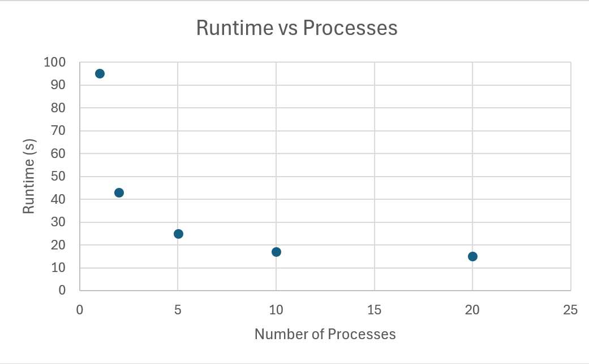

# System Programming Lab 11 Multiprocessing
## Process
For this lab I created a new file called mandelmovie.c. In this file I knew I wanted to use a semaphore to control the process. I thought about how each image could be divided equally into the processes using the semaphore. If i set the semaphore to control the number of processes made and then just set a for loop to loop through each image and continuously make processes. After each image is made the program waits for the programs to end and then cleans up.
## Graph

## Conclusion
You would think the findings would be an exponential descrease in time as the program would run so much faster with 20 processes instead of 10 compared to 5 processes instead of 2. The time does decrease but it is not as exponential as you would think. The difference between 10 and 20 processes is very minimal.